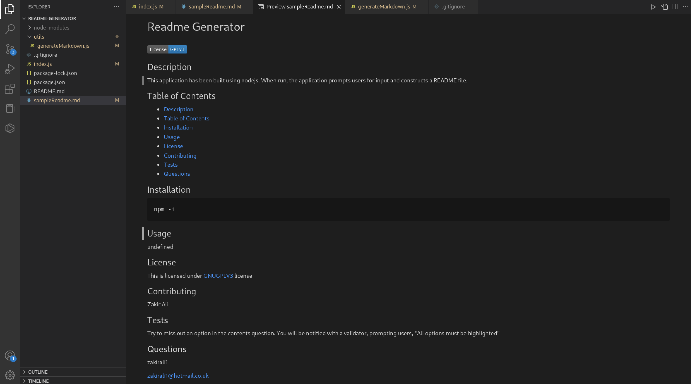

# README Generator

  

  ## Description
  This application has been built using nodejs. When run, it will accept user input and populate content for given section of README. 

  ## Table of Contents
  - [Description](#description)
  - [Table of Contents](#table-of-contents)
  - [Installation](#installation)
  - [Usage](#usage)
  - [License](#license)
  - [Contributing](#contributing)
  - [Tests](#tests)
  - [Questions](#questions)
  ## Installation 
    npm -i

  ## Usage

  You will find a screenshot below, highlighting the application in use. This section shows you the output of the .md file using input taken when the application is run.

  
  

  ## License
   This is licensed under [MIT](https://choosealicense.com/licenses/mit/) license.
 

  ## Contributing
  Zakir Ali.

  ## Tests
  Try to not select all options when asked about what to include in contents.

  ## Questions
  Reach me at my gitHub at [Github](https://github.com/zakirali1)
   or [Email](zakirali1@hotmail.co.uk)
   